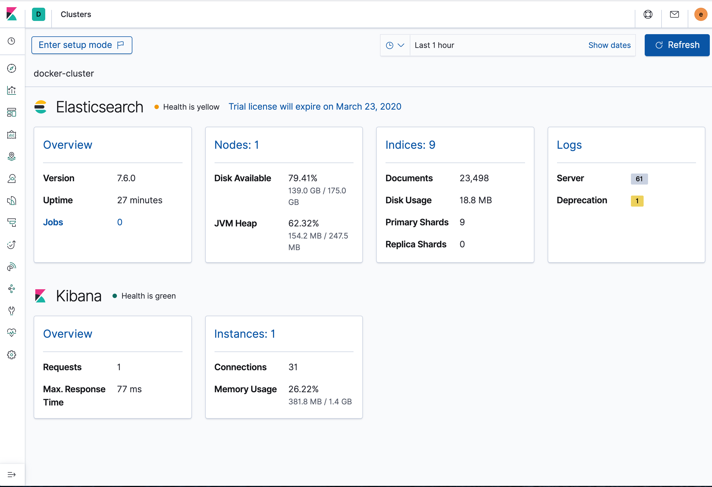

# What is this?
How to configure monitoring of the Elastic Stack running in Docker.  The Filebeat and Metricbeat configs are in the Docker/ dir, but the heart of how this is enabled is in the do-it-all.sh.  By simply adding labels to Elasticsearch and Kibana containers the Beats autodiscover the Elasticsearch and Kibana logs and metrics.  Look for lines similar to:
```
--label co.elastic.logs/module=elasticsearch \
```

# Steps

### Grab this repo
`git clone git@github.com:DanRoscigno/elastic_stack_monitoring_examples.git`

`cd elastic_stack_monitoring_examples/Docker/`

### Start everything

You can simply run `./do-it-all.sh` and let it go.  While it is running 
open another terminal and look at `do-it-all.sh` to see what is 
happening, and look at the configuration files that are being downloaded.

### View monitoring information

Navigate to Kibana at http://localhost:5601/app/monitoring and you should
logs and metrics for Elasticsearch in the Stack Monitoring application.

Username is elastic, password is foo




# Monitoring the Elastic Stack
The configurations provided monitor the logs and metrics for
Elasticsearch and Kibana using stack monitoring.

## Collecting Elasticsearch and Kibana logs
Filebeat is configured to collect logs for containers that have *hints*,
(labels) added to them directing Filebeat to collect the logs.  Here
is the Filebeat configuration:
```
filebeat.config:
  modules:
    path: ${path.config}/modules.d/*.yml
    reload.enabled: false

filebeat.autodiscover:
  providers:
    - type: docker
      hints.enabled: true

processors:
- add_cloud_metadata: ~

output.elasticsearch:
  hosts: '${ELASTICSEARCH_HOSTS:elasticsearch:9200}'
  username: '${ELASTICSEARCH_USERNAME:}'
  password: '${ELASTICSEARCH_PASSWORD:}'
```

Note that the `filebeat.autodiscover` provider type `docker` 
is configured with `hints.enabled` set to true.

The docs for autodiscover provide the details, but the script
`do-it-all.sh` contains a good example.  Here is the command
that creates and starts the Elasticsearch container:

```
docker run -d \
  --name=elasticsearch \
  --label co.elastic.logs/module=elasticsearch \
  --env="discovery.type=single-node" \
  --env="ES_JAVA_OPTS=-Xms256m -Xmx256m" \
  --env="ELASTIC_PASSWORD=foo" \
  --env="xpack.license.self_generated.type=trial" \
  --env="xpack.security.enabled=true" \
  --env="xpack.ml.enabled=false" \
  --network=course_stack \
  -p 9300:9300 -p 9200:9200 \
  --health-cmd='curl -s -f --user elastic:foo http://localhost:9200/_cat/health' \
  docker.elastic.co/elasticsearch/elasticsearch:7.6.0
```

The `label` `co.elastic.logs/module=elasticsearch` is added to the 
Elasticsearch container, and Filebeat checks for labels marked
with `co.elastic.logs`.  When Filebeat sees the label
`co.elastic.logs/module=elasticsearch` it uses the `elasticsearch`
Filebeat module to collect the logs from this container.  These logs are
then available in Stack Monitoring.

## Collecting Elastic Stack metrics

Metricbeat is used to collect the metrics from Elasticsearch and Kibana.
Here is the configuration for the Metricbeat `elasticsearch` module (see the [complete file](https://github.com/DanRoscigno/elastic_stack_monitoring_examples/blob/master/Docker/metricbeat.docker.yml)):
```
metricbeat.autodiscover:
  providers:
    - type: docker
      hints.enabled: true
      labels.dedot: true
      templates:
        - condition:
            contains:
              docker.container.image: elasticsearch
          config:
            - module: elasticsearch
              metricsets:
                # Note: Stack monitoring requires all of
                # these metricsets to be enabled
                - ccr
                - enrich
                - cluster_stats
                - index
                - index_recovery
                - index_summary
                - ml_job
                - node_stats
                - shard
              period: 10s
              hosts: "${data.host}:9200"
              username: "elastic"
              password: "foo"
              # Note: the xpack.enabled boolean configures the
              # index used for the monitoring data.  If this is 
              # not set to true the monitoring data will be 
              # written to the same index as all Metricbeat data
              # and will not be present in the Stack Monitoring 
              # app in Kibana.  When xpack.enabled is true the 
              # monitoring data is written to the .monitoring 
              # index.
              xpack.enabled: true
```

